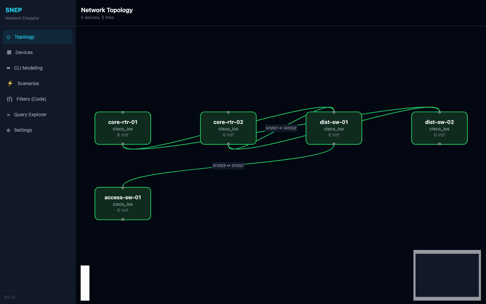
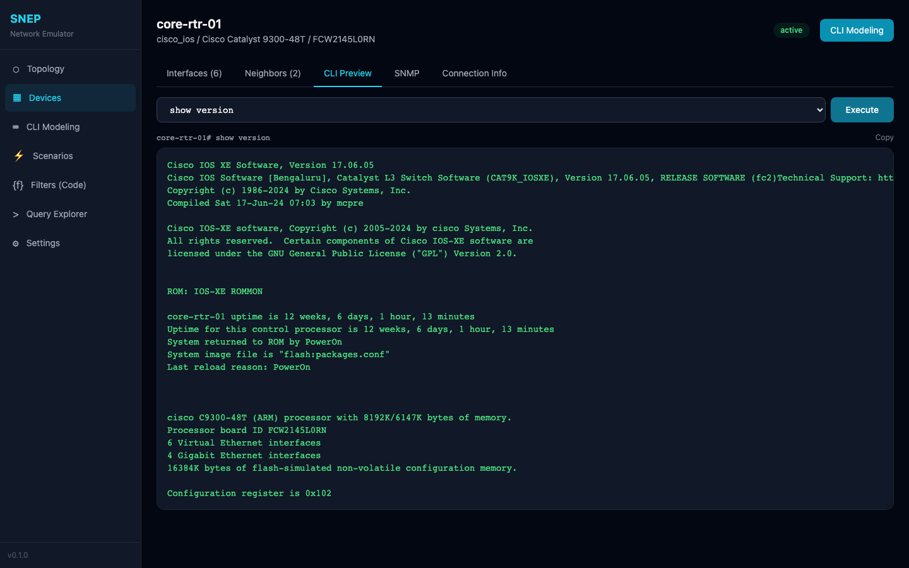
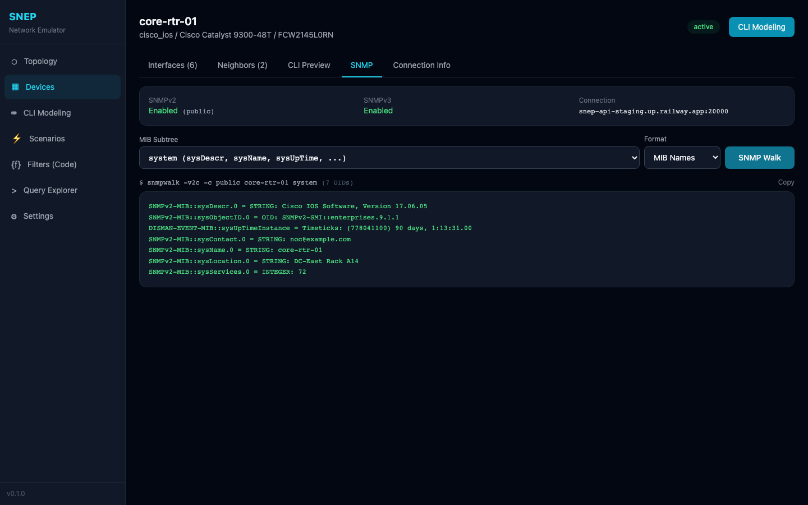
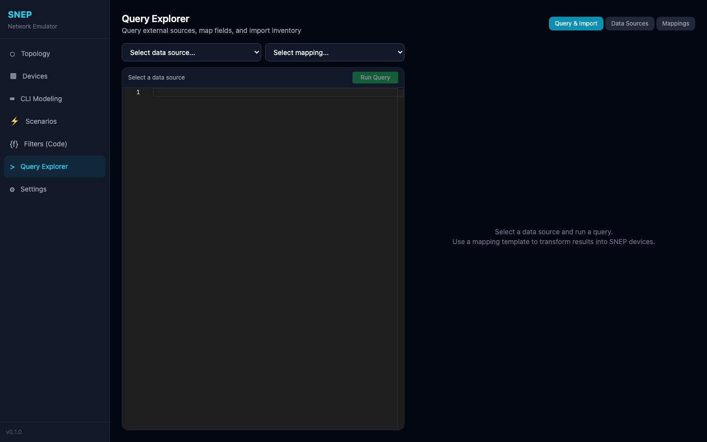
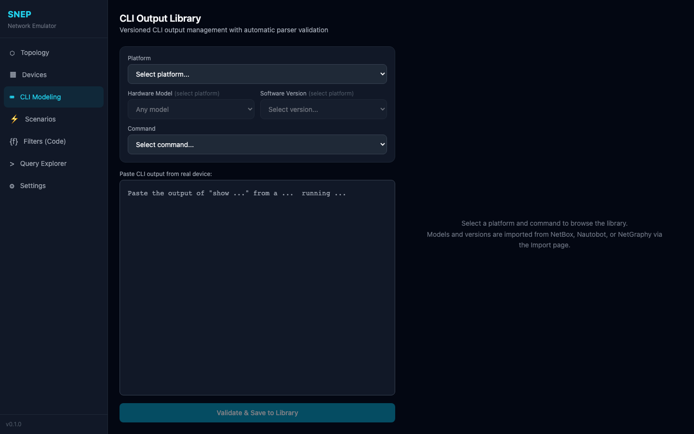
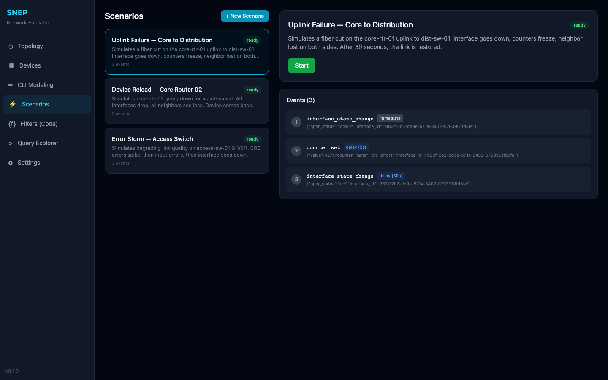
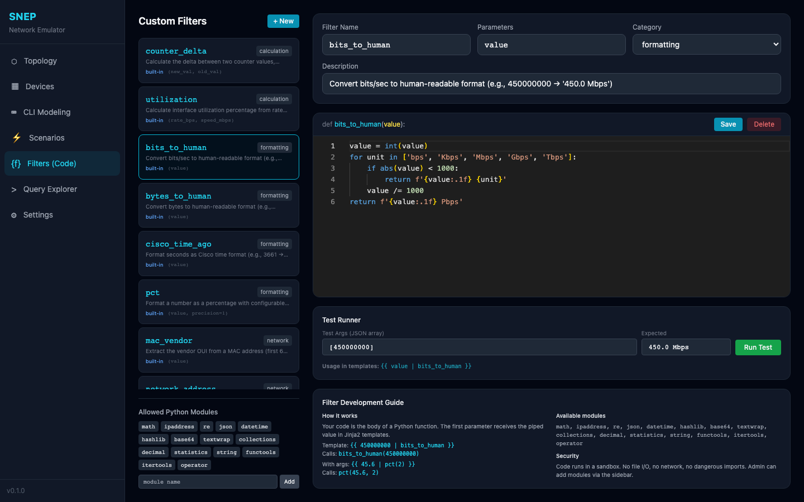
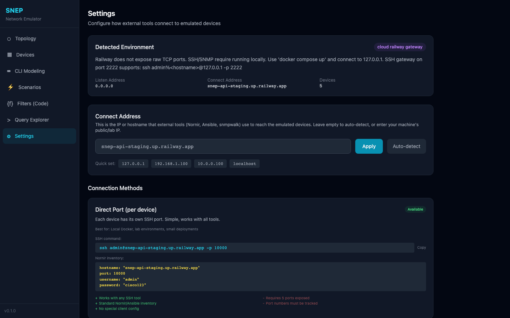
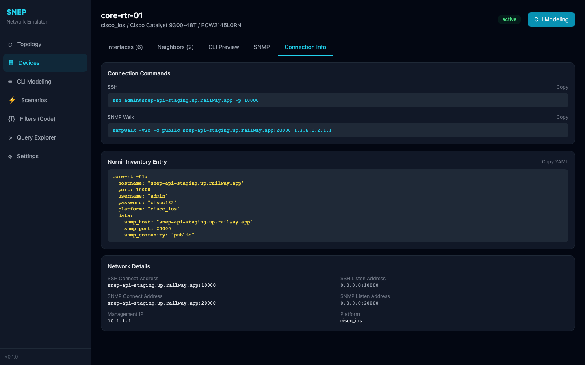

# SNEP - Synthetic Network Emulator Platform

**What if you could test your entire network automation stack against 10,000 realistic devices -- without a single piece of hardware, a single vendor license, or a single dollar in cloud compute?**

SNEP emulates enterprise network devices at the protocol level. SSH into an emulated Cisco switch, run `show version`, and get output that passes through TextFSM parsers without modification. Walk IF-MIB via SNMP and get counter values that advance in real time. Inject faults and watch your automation react -- all from a laptop running Docker.

This isn't a mock. It's not a simulator. It's a **protocol-level emulator** that makes your tools believe they're talking to real hardware.



---

## Why SNEP Exists

Network automation development has a tooling gap:

| Approach | Problem |
|----------|---------|
| **Real hardware labs** | $50K+ per rack, weeks to provision, impossible to share remotely |
| **GNS3 / EVE-NG** | 2 GB RAM per device, requires licensed vendor firmware, max ~50 devices |
| **Mock tools** | No protocol fidelity -- parsers fail, SNMP doesn't work, no cross-protocol consistency |

SNEP fills this gap: **thousands of devices on a single machine, zero vendor licensing, full SSH + SNMP protocol support, realistic CLI output that parsers actually accept.**

### Who It's For

- **Network automation engineers** testing Nornir, Ansible, Netmiko, or custom scripts
- **Parser developers** validating TextFSM, Genie, or NTC-Templates against real-format output
- **Platform teams** building network source-of-truth or incident management systems
- **AI/ML researchers** training network-aware agents that interact via SSH/SNMP
- **Educators** who need safe, disposable lab environments

---

## Key Features

### 1. Realistic CLI Emulation

SSH into any device and run show commands. Output is generated from structured state using platform-specific Jinja2 templates -- not static text files.



Supported commands include `show version`, `show interfaces`, `show ip interface brief`, `show cdp neighbors`, `show inventory`, and more. Output matches real Cisco IOS/IOS-XE and Arista EOS formatting down to the column alignment.

**Platform-aware rendering:** A Catalyst 9300 shows `flash:packages.conf` while an ISR 4331 shows `bootflash:isr4300-universalk9.16.09.06.SPA.bin`. The train name `[Bengaluru]` appears for 17.04-17.06, `[Fuji]` for 16.07-16.09. All driven by structured data, not hardcoded strings.

### 2. SNMP OID Walker

Walk system MIB, IF-MIB ifTable, and ifXTable with exact net-snmp output formatting. Counter values advance in real time based on configurable rates.



```
IF-MIB::ifDescr.1 = STRING: GigabitEthernet1/0/1
IF-MIB::ifType.1 = INTEGER: ethernetCsmacd(6)
IF-MIB::ifOperStatus.1 = INTEGER: up(1)
IF-MIB::ifHCInOctets.1 = Counter64: 994265568957
```

Counters wrap at 32-bit and 64-bit boundaries. Interface status maps consistently between CLI and SNMP. Bring an interface down and both `show ip interface brief` and `ifOperStatus` reflect the change simultaneously.

### 3. Query Explorer -- Import Inventory from Anywhere

Pull devices from NetBox, Nautobot, or NetGraphy using **your own GraphQL or Cypher queries**. Map fields to SNEP's data model using Jinja2 templates with the full custom filter library available.



The flow:
1. **Configure a data source** (URL + API token for NetBox/Nautobot, or Bolt URI for NetGraphy)
2. **Write a query** in Monaco editor (GraphQL or Cypher)
3. **Run it** and see raw results
4. **Select a mapping template** (or write your own Jinja2)
5. **Preview** what would be imported
6. **Import** -- devices, interfaces, links, and connection mappings created automatically

Built-in mapping templates for NetBox, Nautobot, and NetGraphy are included. Create your own for custom data sources.

### 4. CLI Output Library -- Versioned, Parser-Validated

Paste real CLI output from production devices, organized by platform, hardware model, and software version. The system automatically validates against parsers and detects structural changes across versions.



- **Version comparison:** Paste output from IOS 16.09 and 17.06 -- SNEP shows exactly what changed and whether existing parsers still work
- **Parser validation:** TextFSM and regex extraction run automatically, showing which fields were parsed
- **Recommendation engine:** "Use existing parser" / "Minor change -- review" / "Significant change -- new parser needed"

### 5. Fault Scenarios with Cascading Syslog

Build and execute fault scenarios that generate realistic cascading effects across devices. When an interface goes down, SNEP generates syslog on the device **and** on every connected neighbor.



Pre-built scenarios include:
- **Uplink Failure:** Interface down + CRC errors + restore (with cascading neighbor loss)
- **Device Reload:** All interfaces down + all neighbors affected + warm restart
- **Error Storm:** Escalating CRC errors + input errors + eventual interface failure

Syslog messages use exact Cisco IOS formatting:
```
*Mar 29 14:30:00.123: %LINK-3-UPDOWN: Interface GigabitEthernet1/0/1, changed state to down
*Mar 29 14:30:01.124: %LINEPROTO-5-UPDOWN: Line protocol on Interface GigabitEthernet1/0/1, changed state to down
```

Build your own scenarios with the visual scenario builder -- pick devices, interfaces, triggers (immediate, delay, manual), and actions. **Custom log events** support `{{ variable }}` templating with a live variable picker showing all 100+ device state variables.

### 6. Custom Jinja2 Filters -- Python Code IDE

Write Python functions that become Jinja2 filters usable in every template, CLI output, and syslog message. Full Monaco editor with syntax highlighting, test runner, and sandboxed execution.



```python
# bits_to_human filter
value = int(value)
for unit in ['bps', 'Kbps', 'Mbps', 'Gbps', 'Tbps']:
    if abs(value) < 1000:
        return f'{value:.1f} {unit}'
    value /= 1000
```

Then use anywhere: `{{ 450000000 | bits_to_human }}` renders `450.0 Mbps`.

10 built-in filters included (bits_to_human, bytes_to_human, utilization, subnet_mask, wildcard_mask, network_address, cisco_time_ago, mac_vendor, pct, counter_delta). Admin can add Python modules to the sandbox.

### 7. Topology Visualization

Interactive network graph showing devices as nodes and links as edges. Click a device to navigate to its detail page. Colors indicate status (green = active, red = down).


### 8. Environment-Aware Connectivity

Configure once, connect from anywhere. SNEP auto-detects its runtime environment (Docker, cloud, native) and resolves the correct connect address for external tools.



Three connection methods:
- **Direct Port:** Each device on its own port (`ssh admin@127.0.0.1 -p 10000`)
- **SSH Gateway:** Single port for all devices (`ssh admin%core-rtr-01@127.0.0.1 -p 2222`)
- **Loopback Aliases:** Standard ports on unique IPs (`ssh admin@127.0.0.2`)



### 9. Export to Nornir & Ansible

One-click inventory export with correct connection details:

```yaml
# Nornir hosts.yaml (auto-generated)
core-rtr-01:
  hostname: "127.0.0.1"
  port: 10000
  username: "admin"
  password: "cisco123"
  platform: "cisco_ios"
  data:
    snmp_port: 20000
    snmp_community: "public"
```

---

## Quick Start

```bash
git clone git@github.com:NetGraphy/Network-Data-Emulator.git
cd Network-Data-Emulator
cp .env.example .env
docker compose up -d
```

Wait ~60 seconds for startup, then:

```bash
# SSH into an emulated Cisco switch
ssh admin@127.0.0.1 -p 10000
# Password: cisco123

# Run show commands
core-rtr-01# show version
core-rtr-01# show ip interface brief
core-rtr-01# show cdp neighbors

# SNMP walk
snmpwalk -v2c -c public 127.0.0.1:20000 1.3.6.1.2.1.1

# Web UI
open http://localhost:3000

# API docs
open http://localhost:8000/docs
```

5 Cisco IOS devices are seeded with interfaces, links, SNMP profiles, and connection mappings. 16 CLI output library entries, 3 fault scenarios, and 10 custom Jinja2 filters are ready to use.

---

## Architecture

```
                    +------------------+
                    |   Web UI (React) |
                    +--------+---------+
                             |
                    +--------v---------+
                    |   FastAPI (REST)  |
                    +--------+---------+
                             |
         +-------------------+-------------------+
         |                   |                   |
+--------v------+  +--------v-------+  +--------v--------+
| SSH Emulation |  | SNMP Emulation |  | Rendering Engine |
| (asyncssh)    |  | (async UDP)    |  | (Jinja2)         |
+---------------+  +----------------+  +-----------------+
         |                   |                   |
         +-------------------+-------------------+
                             |
                    +--------v---------+
                    | PostgreSQL (State)|
                    +------------------+
```

**State-driven architecture:** CLI and SNMP outputs are derived from a single source of truth. Change an interface's oper_status and both `show interfaces` and `ifOperStatus` reflect the change without separate updates.

**No per-device processes:** All devices are lightweight state objects. The SSH and SNMP services multiplex thousands of devices over shared listeners.

**Async-first:** SSH uses asyncssh coroutines. SNMP uses async UDP. Template rendering is sub-millisecond. The system handles thousands of concurrent connections.

---

## Tech Stack

| Component | Technology |
|-----------|-----------|
| Backend | Python 3.12, FastAPI, SQLAlchemy async, Alembic |
| Database | PostgreSQL 16 |
| SSH | asyncssh |
| SNMP | Custom async UDP with pysnmp encoding |
| Templates | Jinja2 with custom filter sandbox |
| Frontend | React 18, TypeScript, Vite, Tailwind CSS |
| Code Editor | Monaco Editor (VS Code engine) |
| Graph Viz | React Flow (@xyflow/react) |
| Containers | Docker Compose |

---

## API Reference

Full OpenAPI documentation at `/docs` when running.

Key endpoints:

| Endpoint | Description |
|----------|-------------|
| `GET /api/v1/devices` | List all devices |
| `GET /api/v1/topology` | Full topology graph |
| `POST /api/v1/devices/{id}/execute` | Run CLI command |
| `POST /api/v1/devices/{id}/snmp-walk` | SNMP walk preview |
| `GET /api/v1/export/nornir` | Nornir inventory export |
| `GET /api/v1/export/ansible` | Ansible inventory export |
| `POST /api/v1/scenarios/{id}/start` | Start fault scenario |
| `POST /api/v1/query/execute` | Run query against external source |
| `POST /api/v1/query/import` | Import from query results |
| `POST /api/v1/custom-filters/test` | Test a custom Python filter |

---

## Data Model

```
Platform (cisco_ios, arista_eos)
  |
  +-- Vendor (Cisco, Arista)
  +-- SoftwareVersion (17.06.05, 4.32.2F)
  +-- DeviceModel (Catalyst 9300, ISR 4331)
        |
        +-- Device (core-rtr-01)
              |
              +-- Interface (GigabitEthernet1/0/1)
              |     +-- InterfaceCounter (rate-based progression)
              |
              +-- SNMPProfile (v2c + v3)
              +-- DeviceCredential (SSH auth)
              +-- ConnectionMapping (bind + connect addresses)
              +-- LogEntry (syslog buffer)

Link (interface_a <-> interface_b, with discovery protocol)
Scenario -> ScenarioEvent (trigger + action + rollback)
CommandOutputLibrary (versioned CLI samples per platform/version/model)
CustomFilter (Python code -> Jinja2 filter)
DataSource + ImportMapping (external query -> Jinja mapping -> import)
```

---

## Contributing

SNEP is part of the [NetGraphy](https://github.com/NetGraphy) project. Issues and pull requests welcome.

---

## License

See [LICENSE](LICENSE) for details.
